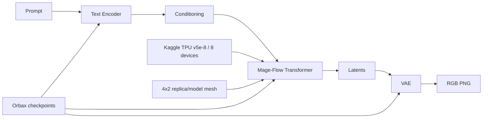

# Mage-Flow-Turbo on TPU v5e-8

> 🌐 Language / Ngôn ngữ: **English** | [Tiếng Việt](README.vi.md)

[](https://github.com/dangkhoa2016/Mage-Flow-Turbo-On-TPU-v5e8/actions/workflows/ci.yml)
[](https://github.com/dangkhoa2016/Mage-Flow-Turbo-On-TPU-v5e8/releases/tag/v1.0.0)
[](LICENSE)
[](MODEL_LICENSE.md)
[](https://www.python.org/)
[](https://github.com/jax-ml/jax)
[](https://keras.io/)
[](https://www.kaggle.com/)

A reproducible **JAX / Keras 3 runtime and TPU production engineering project for Mage-Flow-Turbo**, qualified on Kaggle TPU v5e-8.

This repository contains the runtime source, TPU orchestration, correctness contracts, CPU regression tests, acceptance metadata, and documentation used to run the converted Mage-Flow-Turbo model on an 8-device TPU v5e-8 environment. It is an independent conversion/runtime engineering project; it does **not** claim to retrain or replace the upstream Mage-Flow model.


## Status

| Item | Qualified value |
| --- | --- |
| Release | `v1.0.0` |
| Qualified runtime commit | `b9d39a55d8969fc22b9666fa4a415c8523ee3e8f` |
| Accelerator | Kaggle TPU v5e-8 |
| TPU devices | 8 |
| Preferred topology | `4x2` replica/model |
| Denoising steps | 4 |
| Qualified resolutions | 512, 768, 1024 |
| Default acceptance seeds | 42, 43, 44, 45 |
| Transformer parameters | 397 leaves |
| Sharding | 174 sharded / 223 replicated |
| VAE runtime binding | 728 / 728 |
| Production acceptance | PASS |

The tagged v1.0.0 runtime is the qualified source baseline. Documentation-only changes on `main`, when present, do not change the accepted inference core unless explicitly stated.

## What this repository provides

- JAX/Keras Transformer runtime source under `runtime/final/source/mage_flow_keras/`.
- A production TPU runner with isolated Text Encoder, Transformer, and VAE stages.
- Explicit topology, resolution, attention, checkpoint, RoPE, and runtime-path controls.
- Fail-closed validation for unsupported attention arguments and unequal packed request lengths.
- Qualified attention policies for 512, 768, and 1024.
- CPU regression tests for attention equivalence, topology/policy contracts, portable paths, and BF16 timestep semantics.
- Machine-readable production acceptance metadata.
- English and Vietnamese documentation for model conversion, TPU execution, benchmarks, reproducibility, limitations, and troubleshooting.
- A public JAX/Orbax model distribution on Hugging Face and Kaggle.

## Public model distribution

This GitHub repository is the **runtime engineering source**. Large converted model artifacts are distributed separately.

| Surface | Purpose |
| --- | --- |
| [Hugging Face model](https://huggingface.co/dangkhoa2016/Mage-Flow-Turbo-JAX-TPU-v5e8) | Primary platform-neutral JAX/Orbax model artifact |
| [Kaggle Model](https://www.kaggle.com/models/dangkhoa2016/mage-flow-turbo-jax-tpu-v5e8) | Kaggle-native model distribution |
| [Kaggle TPU demo](https://www.kaggle.com/code/dangkhoa2016/mage-flow-turbo-jax-tpu-v5e8-demo) | Ready-to-run TPU demonstration |
| [Upstream Microsoft Mage](https://github.com/microsoft/Mage) | Original model family and research project |

The converted distribution contains native Orbax checkpoints for the Text Encoder, Transformer, and VAE plus tokenizer/configuration and portable runtime support assets.

## Generated examples

The following four 1024×1024 images were generated with the public JAX/Orbax artifact on TPU v5e-8 and manually selected from seed-controlled outputs.


These images are qualitative examples, **not** benchmark measurements.

## Start here

| Goal | Start with |
| --- | --- |
| Understand what was converted | [Model and conversion](docs/model-and-conversion.md) |
| Run on Kaggle TPU v5e-8 | [Kaggle TPU guide](docs/kaggle-tpu-v5e8.md) |
| Understand the runtime design | [Architecture](docs/architecture.md) |
| Use the production runner | [Inference guide](docs/inference-guide.md) |
| Interpret performance numbers | [Benchmarks](docs/benchmarks.md) |
| Reproduce the qualified result | [Reproducibility](docs/reproducibility.md) |
| Audit release evidence | [Release and verification](docs/release-and-verification.md) |
| Diagnose a failure | [Troubleshooting](docs/troubleshooting.md) |
| Understand boundaries | [Limitations](docs/limitations.md) |
| Browse all documentation | [Documentation Hub](docs/index.md) |

## Architecture



The production runner deliberately executes Text Encoder, Transformer, and VAE as isolated subprocess stages. Model state is constructed/restored on CPU before TPU mesh `device_put`, which is part of the qualified runtime contract.

See [Architecture](docs/architecture.md) for the full execution model.

## Qualified TPU profile

| Resolution | Production attention | Query chunk |
| --- | --- | ---: |
| 512 | segmented | — |
| 768 | segmented | — |
| 1024 | segmented-query-chunk | 256 |

The production runner supports topology arguments `1x8`, `2x4`, and `4x2`, but the published production qualification uses **4x2**. Only the four-step denoising schedule is accepted by the qualified runner.

### Warm stage performance

| Resolution | Warm Transformer batch / 4 | Effective s/image | Images/min | Peak HBM/chip | Warm VAE batch |
| --- | ---: | ---: | ---: | ---: | ---: |
| 512 | 13.124 s | 3.281 | 18.29 | ~9.18 GB | 0.736 s |
| 768 | 15.228 s | 3.807 | 15.76 | ~14.76 GB | 0.750 s |
| 1024 | 33.542 s | 8.385 | 7.16 | ~12.53 GB | 0.782 s |

> **Benchmark scope:** these are warm **Transformer-stage** and warm **VAE-stage** measurements from the qualified production runner. They are not full cold-start or end-to-end image-generation latency and should not be compared directly with full-pipeline GPU timings.

See [Benchmarks](docs/benchmarks.md) for scope and interpretation.

## Correctness and acceptance

The production acceptance verifies:

- TPU backend with 8 devices;
- 397 Transformer parameter leaves;
- 174 sharded / 223 replicated parameters;
- VAE runtime binding coverage `728/728`;
- deterministic bit-exact warm reruns;
- unique outputs across seeds;
- PNG byte identity with the previously visually accepted qualification outputs;
- no runtime monkey patch required for promoted segmented/query-chunk attention.

The machine-readable authority is [`acceptance/PRODUCTION_ACCEPTANCE.json`](acceptance/PRODUCTION_ACCEPTANCE.json).

## Quick start

The repository intentionally does not store the large Orbax checkpoints or the complete pinned runtime cache. Attach/download the public model artifact first, then point the runner at the model and runtime paths.

```bash
python3 bootstrap/06_run_tpu_inference.py \
  --topology 4x2 --resolution 1024 --seeds 42,43,44,45 --steps 4 \
  --attention auto --model-root "$MODEL_ROOT" --runtime-root "$RUNTIME_ROOT" \
  --runtime-site "$RUNTIME_SITE" --text-checkpoint "$TEXT_CHECKPOINT" \
  --transformer-checkpoint "$TRANSFORMER_CHECKPOINT" --vae-checkpoint "$VAE_CHECKPOINT" \
  --vae-manifest "$VAE_MANIFEST" --basis-dim16 "$BASIS_DIM16" \
  --basis-dim56 "$BASIS_DIM56" --output "$OUTPUT_DIR"
```

Use the public Kaggle demo for the shortest reproducible execution path. Use this repository directly when you need to inspect or integrate the runtime engineering source.

## Development and CI

```bash
python -m pip install -r requirements-ci.txt
python -m compileall -q runtime bootstrap tests scripts
pytest -q tests/test_cpu_regressions.py
python scripts/check_docs.py
python scripts/check_repo_health.py
git diff --check
```

CPU CI validates source-level contracts; it does **not** replace a real TPU qualification run.

## Documentation

The README is the landing page. Detailed documentation lives in the [Documentation Hub](docs/index.md).

| Topic | English | Tiếng Việt |
| --- | --- | --- |
| Architecture | [Open](docs/architecture.md) | [Mở](docs/architecture.vi.md) |
| Model and conversion | [Open](docs/model-and-conversion.md) | [Mở](docs/model-and-conversion.vi.md) |
| Kaggle TPU v5e-8 | [Open](docs/kaggle-tpu-v5e8.md) | [Mở](docs/kaggle-tpu-v5e8.vi.md) |
| Inference guide | [Open](docs/inference-guide.md) | [Mở](docs/inference-guide.vi.md) |
| Benchmarks | [Open](docs/benchmarks.md) | [Mở](docs/benchmarks.vi.md) |
| Reproducibility | [Open](docs/reproducibility.md) | [Mở](docs/reproducibility.vi.md) |
| Release and verification | [Open](docs/release-and-verification.md) | [Mở](docs/release-and-verification.vi.md) |
| Limitations | [Open](docs/limitations.md) | [Mở](docs/limitations.vi.md) |
| Troubleshooting | [Open](docs/troubleshooting.md) | [Mở](docs/troubleshooting.vi.md) |
| Production runtime authority | [Open](docs/tpu-v5e8-production.md) | [Mở](docs/tpu-v5e8-production.vi.md) |

## Community and support

- [Contributing](.github/CONTRIBUTING.md)
- [Code of Conduct](.github/CODE_OF_CONDUCT.md)
- [Security Policy](.github/SECURITY.md)
- [Support](.github/SUPPORT.md)
- [Issue templates](.github/ISSUE_TEMPLATE)
- [Pull request template](.github/PULL_REQUEST_TEMPLATE.md)

Security-sensitive reports should follow the private-reporting guidance in [SECURITY.md](.github/SECURITY.md), not a public issue.

## License and upstream attribution

The repository-level [MIT License](LICENSE) covers original engineering code and documentation for which this repository can grant MIT rights.

Model-related components have a separate licensing boundary:

- Mage-Flow / Mage-Flow-Turbo lineage: upstream **MIT**.
- Qwen3-VL-derived Text Encoder/tokenizer lineage: upstream **Apache License 2.0**.
- Converted model weights remain subject to applicable upstream terms and are **not relicensed** by this repository.

See [MODEL_LICENSE.md](MODEL_LICENSE.md), [MODEL_LICENSE.vi.md](MODEL_LICENSE.vi.md), [THIRD_PARTY_NOTICES.md](THIRD_PARTY_NOTICES.md), [NOTICE.md](NOTICE.md), and the preserved upstream license texts in [licenses/](licenses/).

## Author

**Đăng Khoa**

`i.am@dangkhoa.dev`

## Acknowledgements

This project builds on Microsoft Mage/Mage-Flow, JAX, Keras, Orbax, Qwen3-VL components, Kaggle TPU infrastructure, and the wider open-source Python ecosystem. Their projects, trademarks, models, services, and licenses remain independent of this repository.
