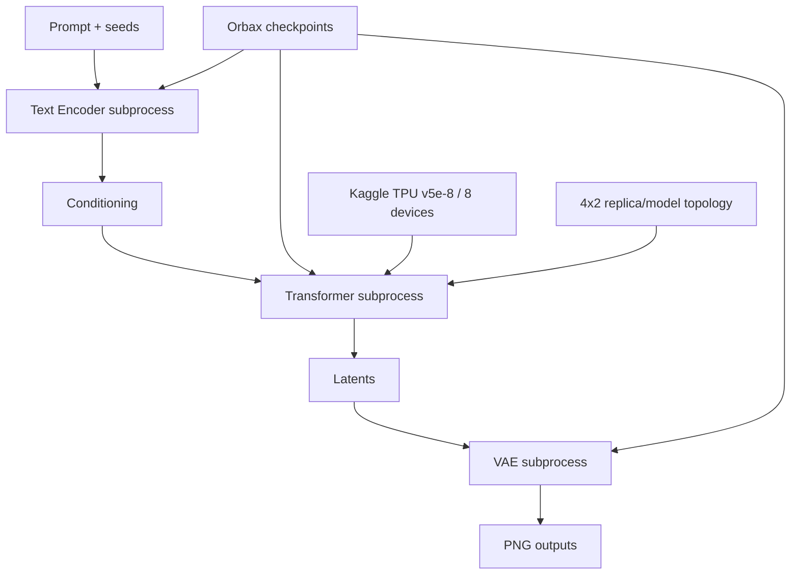

# Architecture

> 🌐 Language / Ngôn ngữ: **English** | [Tiếng Việt](architecture.vi.md)

## Execution pipeline

The production runner is `bootstrap/06_run_tpu_inference.py`. It orchestrates isolated Text Encoder, Transformer, and VAE stages so stage failures and artifact boundaries remain explicit.

Model state is constructed/restored on CPU before TPU mesh `device_put`.

## Transformer placement
The accepted contract records 397 parameter leaves: 174 sharded and 223 replicated. The runner parses `1x8`, `2x4`, and `4x2`; the published qualification uses `4x2`.

## Attention
The runtime implements `masked-global`, `segmented`, and `segmented-query-chunk`. Production `auto` selects segmented at 512/768 and segmented-query-chunk with query chunk 256 at 1024.

Segmented production paths require equal packed request lengths and fail closed otherwise.

## BF16 timestep invariant
`jnp.asarray(timesteps, dtype=jnp.bfloat16).astype(jnp.float32)`

The CPU regression suite freezes this semantic. A change requires TPU re-qualification.
