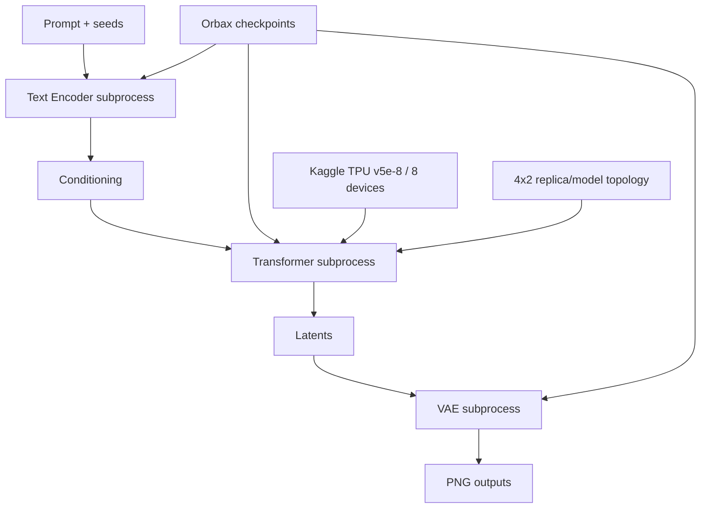

# Kiến trúc

> 🌐 Ngôn ngữ / Language: [English](architecture.md) | **Tiếng Việt**

## Pipeline thực thi

Production runner là `bootstrap/06_run_tpu_inference.py`. Runner orchestration các stage Text Encoder, Transformer và VAE tách biệt để lỗi theo stage và ranh giới artifact luôn rõ ràng.

Model state được construct/restore trên CPU trước khi `device_put` vào TPU mesh.

## Transformer placement
Contract đã acceptance ghi nhận 397 parameter leaves: 174 sharded và 223 replicated. Runner parse `1x8`, `2x4`, `4x2`; qualification đã công bố dùng `4x2`.

## Attention
Runtime triển khai `masked-global`, `segmented` và `segmented-query-chunk`. Production `auto` chọn segmented ở 512/768 và segmented-query-chunk với query chunk 256 ở 1024.

Segmented production path yêu cầu packed request có cùng chiều dài và fail closed nếu không thỏa.

## BF16 timestep invariant
`jnp.asarray(timesteps, dtype=jnp.bfloat16).astype(jnp.float32)`

CPU regression suite đóng băng semantic này. Nếu thay đổi cần re-qualification trên TPU.
